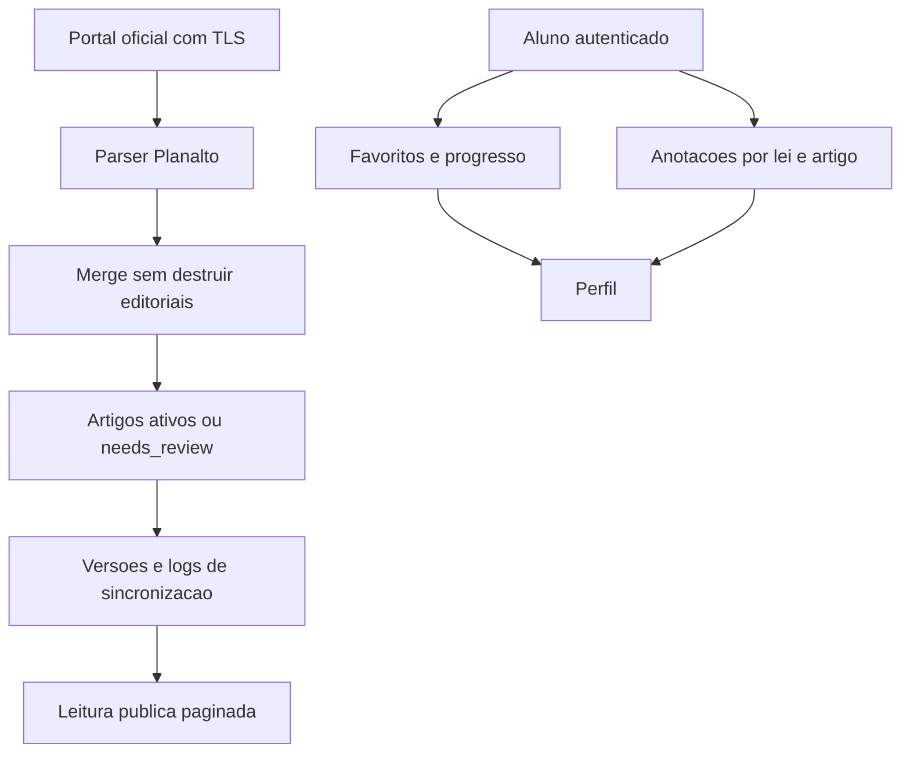

# Fase 05 - Lei Comentada

Data: 2026-07-11

## Escopo

Esta fase separa definitivamente a manutencao de schema das rotas HTTP da Lei
Comentada e protege o acervo editorial contra perdas decorrentes de uma leitura
oficial incompleta. Tambem move as anotacoes pessoais do aluno para a API
autenticada e banco de dados.

Fora de escopo: texto oficial de novas leis, reclassificacao editorial em massa,
novas regras comerciais de plano e destaque visual pessoal do leitor.

## Diagnostico confirmado

Auditoria de producao antes da mudanca:

- 2 leis, 77 secoes, 478 artigos e 2.521 blocos oficiais;
- 4 versoes de leis e 956 versoes de artigos;
- 2 comentarios de professor, 1 sumula, 14 comentarios de usuarios e 2 reacoes;
- 4 favoritos e 6 registros de progresso;
- 28 logs de sincronizacao;
- nao existia tabela para anotacoes pessoais (`legal_user_notes`).

O repositorio antigo executava bootstrap de schema e migrations de compatibilidade
em caminhos de leitura/escrita. Isso colocava DDL, alteracoes de dados e rotinas
de limpeza no caminho de requisicoes publicas. A sincronizacao tambem excluia
artigos, secoes e editoriais ausentes no payload importado, mesmo quando a
ausencia podia ser apenas uma falha temporaria do parser oficial.

## Modelo canonico

O texto oficial vive em `laws`, `law_sections`, `law_articles` e
`law_article_blocks`. Os editoriais vivem em tabelas proprias
(`teacher_comments`, jurisprudencia, doutrina, sumulas, macetes e analises de
secao) e nao sao recriados ou removidos por uma sincronizacao oficial parcial.

## Persistencia e autorizacao

- Favoritos e progresso permanecem no backend e usam o usuario autenticado.
- Anotacoes passam a usar `legal_user_notes`, com uma nota por
  `user_id + law_article_id`, FK para lei/artigo e limite de 10.000 caracteres.
- Marcacoes ricas do leitor passam a usar `legal_user_reader_annotations`, com
  uma versao por `user_id + law_section_id`, isolada do texto oficial.
- A API de anotacoes exige autenticacao e confirma que o artigo pertence a lei
  informada antes do upsert.
- O perfil deixa de consultar notas do navegador e passa a listar/remover pela
  API autenticada.
- `created_by_user_id` nao e atualizado em edicoes. Um membro `staff` somente
  pode alterar lei criada por ele; admin mantem a capacidade editorial global.

## Sincronizacao oficial

- URL do Planalto continua restrita a origem permitida e HTTPS.
- A sincronizacao chama `saveAdminPayload(..., true)`.
- Artigos que nao vierem no payload nao sao apagados: artigos ativos recebem
  `official_status = needs_review` e data da mudanca.
- Secoes e editoriais ausentes tambem sao preservados durante sincronizacao.
- Exclusao fisica continua disponivel apenas no save editorial explicito do
  admin, nunca no fluxo automatico do Planalto.
- A importacao registra snapshots e logs existentes; falhas continuam sendo
  auditadas em `legal_sync_logs` e `sync_errors`.

## Migration, deploy e rollback

Migration aditiva:

`backend/database/migrations/20260711_020000_legal_commentary_canonical.php`

`backend/database/migrations/20260711_020010_legal_reader_annotations.php`

Ela cria a tabela de anotacoes e completa colunas/indices requeridos pelo modulo,
incluindo `law_articles.official_status`. Nao remove colunas, indices ou linhas.
O runtime agora usa `SchemaReadiness` e falha explicitamente se a migration nao
tiver sido aplicada, em vez de alterar o banco por uma requisicao do usuario.

Aplicacoes em producao:

- `20260711_020000_legal_commentary_canonical`: `2026-07-11 11:45:08`,
  responsavel `phase05-production`, duracao de `1007 ms`;
- `20260711_020010_legal_reader_annotations`: `2026-07-11 14:48:22`,
  responsavel `phase05-production`, duracao de `80 ms`.

O status posterior confirmou zero migrations pendentes e checksum valido para
ambas.

Rollback de aplicacao: retornar o backend/frontend ao commit anterior e restaurar
o backup de arquivos. O rollback SQL nao deve apagar a tabela ou colunas novas,
pois a migration e aditiva. Em caso de falha operacional, interromper a
sincronizacao automatica e investigar o log antes de reexecutar.

## Arquivos relevantes

- `backend/modules/legal_commentary/repositories/LegalCommentaryRepository.php`
- `backend/modules/legal_commentary/services/PlanaltoImportService.php`
- `backend/modules/legal_commentary/services/LegalCommentaryService.php`
- `backend/modules/legal_commentary/routes.php`
- `backend/api/legal-commentary/notes.php`
- `src/services/legal-commentary/legalCommentaryApiService.ts`
- `src/app/profile/ProfilePage.tsx`

## Validacao

- lint PHP dos arquivos e migration alterados;
- `C:\xampp\php\php.exe backend/tests/LegalCommentaryPhase05WiringTest.php`;
- `npm run typecheck` e `npm run build` local e na VPS;
- dry-run e aplicacao controlada da migration na VPS;
- backup de banco e arquivos em
  `/root/backups/concursomestre-phase05-20260711_144157` com SHA-256;
- endpoint publico de leitura: `200` e envelope de sucesso;
- endpoint de anotacoes sem sessao: `401`, como esperado;
- endpoint de marcacoes ricas sem sessao: `401`, como esperado;
- PHP-FPM e frontend ativos apos reload/restart;
- probe transacional de save de anotacao: sucesso e rollback confirmado;
- probe transacional de save de marcacao rica: sucesso e rollback confirmado;
- inventario posterior preservado: 2 leis, 77 secoes, 478 artigos, 2.521
  blocos, 4 favoritos, 6 progressos, 14 comentarios e 28 logs.

## Pendencias deliberadas

- Nao foi feito backfill automatico de notas antigas do navegador. A migracao
  deve ocorrer somente com acao explicita do usuario para nao enviar dados locais
  sem consentimento.
- A persistencia do snapshot e do log de sincronizacao ocorre apos a transacao
  principal do save. A escrita oficial ja e transacional; consolidar tambem a
  auditoria no mesmo commit e melhoria futura de observabilidade.

## Estado da fase

Fase concluida. O acervo oficial esta protegido contra exclusoes por payload
parcial do Planalto; anotacoes e marcacoes ricas passaram a ter persistencia
autenticada.
