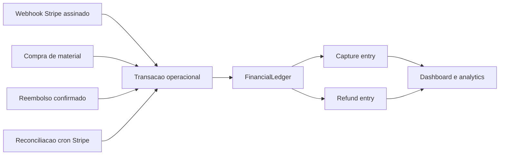

# Fase 06 - Financeiro, Assinaturas e Webhooks

Data: 2026-07-11

## Escopo

Esta fase consolida a apuracao financeira a partir de fatos comprovados de
cobranca e estorno. Ela cobre transacoes, assinaturas Stripe, reembolsos,
cupons, webhooks, reconciliacao e os agregados administrativos. Marketplace,
interface comercial e precificacao de planos continuam fora do escopo desta
fase, salvo quando dependem diretamente da consistencia financeira.

## Diagnostico confirmado em producao

Auditoria de leitura em `concursomestre` antes da migration:

- transacoes Stripe de plano: 13 aprovadas, total bruto de R$ 137,50;
- transacoes de plano marcadas como reembolsadas: 7, total bruto de R$ 215,00;
- transacoes de plano canceladas: 4, total bruto de R$ 79,60;
- 7 transacoes reembolsadas e 4 canceladas eram legadas e nao possuíam
  `user_subscription_id`; elas nao serao vinculadas por inferencia;
- nao ha referencias financeiras duplicadas de provider;
- assinaturas: 10 canceladas Stripe, 1 ativa manual, 1 ativa Stripe e 1
  `trialing` Stripe;
- nao ha assinatura Stripe ativa sem `provider_subscription_id`;
- webhooks: 234 processados, 38 ignorados, 3 falhas historicas e nenhum evento
  antigo preso em `processing`;
- ha uma reserva de cupom consumida e nenhuma reserva expirada pendente;
- nao ha divergencia atual entre `user_subscriptions` ativa e o cache legado de
  plano em `users`.

As tres falhas historicas de webhook ocorreram em 2026-06-20 para
`customer.subscription.updated`, `invoice.paid` e `invoice.payment_succeeded`.
Elas nao possuem payload bruto suficiente para replay seguro. A reconciliacao
por invoice Stripe continua sendo o caminho seguro para materializar uma
cobranca confirmada ausente.

## Modelo contabil

`transactions` continua sendo o registro operacional: status, provider,
invoice, PaymentIntent, assinatura e fluxo administrativo. O novo
`financial_ledger_entries` e uma visao contabil append-only derivada apenas de
capturas e estornos comprovados.

Definicoes adotadas:

- **captura bruta:** valor efetivamente pago e confirmado pelo provider;
- **estorno:** valor devolvido ao cliente, parcial ou integral;
- **bruto reconhecido:** captura menos estorno;
- **taxa/comissao reconhecida:** fracao da taxa comercial proporcional ao valor
  ainda reconhecido;
- **liquido reconhecido:** bruto reconhecido menos taxa/comissao reconhecida;
- **MRR/ARR:** projecoes de assinaturas ativas, separadas de receita realizada;
- **projecoes:** nunca sao entradas do ledger nem receita capturada.

Em estorno integral, captura e estorno se anulam no ledger. Em estorno parcial,
somente a parcela devolvida e a respectiva taxa comercial proporcional sao
revertidas. Taxas externas do processador nao sao inventadas quando a fonte nao
as fornece.

## Estados e idempotencia

- estados operacionais aceitos: `approved`, `completed`, `refund_requested`,
  `partially_refunded`, `refunded`, `failed`, `rejected`, `canceled` e
  `cancelled`;
- `partially_refunded` permanece como receita liquida parcial e nao cancela uma
  assinatura automaticamente;
- cada entrada possui `entry_key` unica no formato
  `transaction:<id>:capture` ou `transaction:<id>:refund`;
- reprocessar o mesmo webhook ou cron apenas completa referencias e metadata
  ausentes; nao duplica valores;
- eventos Stripe continuam protegidos por `provider_webhook_events` e pelos
  identificadores unicos de invoice/PaymentIntent ja existentes.

## Migration e schema

Migration aditiva aplicada:

`backend/database/migrations/20260711_030000_financial_ledger_foundation.php`

Ela adiciona `transactions.refunded_amount`, cria `financial_ledger_entries` e
completa somente colunas e indices de compatibilidade que ja eram exigidos pelo
runtime. Tambem materializa entradas historicas comprovadas sem alterar status,
valores originais ou vinculos de assinatura.

O bootstrap de schema foi removido das rotas financeiras. Em vez de executar
DDL numa requisicao, `ensurePaymentProviderSchema()` e as reservas de cupom
usam `SchemaReadiness` e orientam a aplicacao da migration via CLI.

Aplicacao em producao concluida em 2026-07-11:

- backup anterior: `/root/backups/concursomestre-phase06-20260711T190847Z`;
- dump MySQL verificado por SHA-256 antes da alteracao;
- migration `20260711_030000` aplicada por `phase06-production` em 96 ms;
- status posterior: zero migrations pendentes e checksum da migration valido;
- ledger inicial: 20 capturas, R$ 352,50 bruto capturado, 7 estornos no total
  de R$ 215,00 e R$ 137,50 de bruto reconhecido;
- nenhum `entry_key` duplicado foi encontrado na conciliacao inicial.

## Webhooks e reconciliacao

- o endpoint Stripe limita o corpo a 1 MiB antes do processamento;
- a assinatura do webhook continua obrigatoria e o evento agora precisa ter o
  mesmo modo (`test` ou `live`) da chave Stripe configurada;
- erros publicos nao revelam excecoes internas; o detalhe tecnico vai para log
  do servidor;
- a reconciliacao de invoices pagas permanece independente de login do aluno;
- eventos ja processados, ignorados ou presos em processamento seguem o fluxo
  idempotente existente.

Durante os probes foi encontrada uma versao antiga da rota publica de
transacoes que aceitava a sessao como opcional. Ela foi substituida pela rota
autenticada atual: chamadas sem `Authorization`, `X-Auth-Token` ou cookie agora
recebem `401` e nao retornam dados financeiros. O endpoint administrativo de
stats e o helper de automacao tambem foram conferidos sem credencial e retornam
`401`.

## Cron operacional

- cron materializado em `/etc/cron.d/concursomestre-finance` a cada 15 minutos;
- comando efetivo: `/usr/bin/php /var/www/concursomestre/backend/scripts/tasks/reconcile_stripe_subscriptions.php`;
- o job executa como o usuario do site, usa o lock
  `subscriptions_stripe_reconciliation` e nao depende de login do aluno;
- o comando apresentado no painel administrativo foi corrigido para o caminho
  atual do CloudPanel;
- uma execucao controlada em producao concluiu com sucesso: 12 assinaturas
  verificadas, zero inconsistencias e zero falhas;
- o heartbeat privado ficou com status `ok` apos a execucao.

## Arquivos relevantes

- `backend/modules/finance/services/FinancialLedger.php`
- `backend/database/migrations/20260711_030000_financial_ledger_foundation.php`
- `backend/modules/subscriptions/services/SubscriptionsService.php`
- `backend/modules/subscriptions/routes.php`
- `backend/modules/transactions/services/TransactionsRefundSupport.php`
- `backend/modules/transactions/services/TransactionsService.php`
- `backend/modules/transactions/repositories/TransactionsRepository.php`
- `backend/modules/admin/services/AdminAnalyticsService.php`
- `backend/modules/admin/services/AdminStatsService.php`
- `backend/config/payment_provider.php`
- `backend/config/stripe.php`
- `backend/modules/subscriptions/services/SubscriptionsAutomationService.php`
- `/etc/cron.d/concursomestre-finance` (configuracao operacional da VPS)

## Rollback

1. Interromper apenas os workers/reloads de backend se uma regressao for
   detectada; nao cancelar cobrancas Stripe.
2. Restaurar os arquivos do backup anterior ao deploy.
3. Manter `financial_ledger_entries` e `refunded_amount`: a migration e
   aditiva e nao deve ser revertida apagando fatos financeiros.
4. Usar o backup de banco somente para desastre confirmado e com conciliacao
   posterior contra Stripe, pois restaurar um snapshot antigo pode esconder
   eventos de pagamento recebidos depois dele.

## Validacao executada

- lint PHP dos arquivos alterados em producao: aprovado;
- `AdminStatsAggregationTest`: aprovado, incluindo estorno parcial;
- `FinancialLedgerPhase06WiringTest`: aprovado;
- `node node_modules/typescript/bin/tsc --noEmit`: aprovado;
- `node node_modules/next/dist/bin/next build`: aprovado;
- migration, backfill idempotente e status do schema: aprovados;
- probes sem credencial das rotas financeiras: `401` confirmado;
- cron e reconciliacao Stripe por CLI: aprovados.

## Riscos residuais conhecidos

- os tres webhooks historicos sem payload bruto nao podem ser reexecutados por
  seguranca; a reconciliacao Stripe deve ser usada caso a invoice correspondente
  ainda precise de materializacao;
- registros legados sem `user_subscription_id` permanecem sem vinculo
  inferido, para evitar atribuir historico financeiro a uma assinatura errada;
- custos efetivos do processador nao sao contabilizados como taxa se o Stripe
  nao os fornecer no evento ou em uma fonte oficial consultada;
- a retencao de garantia continua uma regra operacional de disponibilidade,
  separada da receita reconhecida no ledger;
- a proxima janela de execucao automatica do cron deve ser acompanhada no
  heartbeat do painel; a execucao controlada provou o comando, mas nao substitui
  a observacao operacional continua;
- checkout, renovacao e estorno reais no modo live ainda exigem homologacao
  assistida antes de escalar investimento em trafego pago.

## Estado da fase

Concluida. O codigo, a migration aditiva, o ledger inicial, a protecao das
rotas financeiras e o cron de reconciliacao foram validados em producao sem
cancelar cobrancas ou alterar valores sem evidencia.
