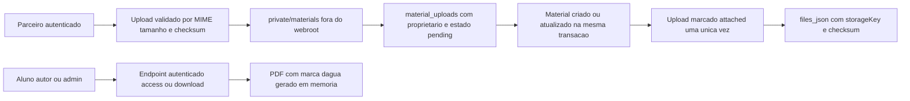

# Fase 07 - Marketplace e Conteudo de Usuarios

Data: 2026-07-11

## Escopo

Esta fase revisa materiais, uploads, leitura protegida, autoria, moderacao,
avaliacoes e a compra local de itens do marketplace. O escopo inclui os
arquivos enviados por parceiros e os recursos do leitor associados a esses
materiais. O checkout Stripe de assinaturas permanece na Fase 06.

## Diagnostico confirmado em producao

Auditoria somente leitura antes da migration:

- `materials`: zero registros;
- compras e transacoes de marketplace: zero registros;
- `material_ratings`: zero registros;
- nao havia PDF legado em `backend/uploads/materials`;
- portanto, nao existe arquivo de material a migrar para o armazenamento
  privado nesta janela.

O fluxo anterior mantinha a URL do PDF e, em alguns casos, a senha do arquivo
dentro de `materials.files_json`. A URL era devolvida pela listagem publica e a
senha podia aparecer na moderacao administrativa. O upload tambem dependia de
DDL executado durante requisicoes HTTP para preparar a tabela de avaliacoes.

## Modelo de arquivos adotado

Politica aplicada:

- PDF integral: `private://materials/<nome-aleatorio>.pdf`, fora do webroot;
- capa: imagem publica em `uploads/covers`, sem conter arquivo integral;
- senha de PDF: nao aceita, nao persiste e nao aparece em DTO ou tela;
- nome de arquivo: aleatorio, derivado do MIME validado, sem nome do cliente;
- integridade: SHA-256, MIME e tamanho registrados em `material_uploads`;
- acesso: somente endpoint autenticado, com verificacao no backend; a UI usa
  Blob URL temporaria e nunca URL direta do disco;
- legado: arquivos antigos em `uploads/materials` seguem acessiveis somente
  pelo endpoint protegido, sem voltar a ser expostos no DTO publico.

## Matriz de permissoes

| Acao | Visitante | Aluno | Autor | Staff | Admin |
| --- | --- | --- | --- | --- | --- |
| Listar material aprovado | Sim | Sim | Sim | Nao por privilegio | Sim |
| Ver material pendente ou rejeitado | Nao | Nao | Somente proprio | Somente proprio | Sim |
| Criar ou editar material | Nao | Somente proprio | Proprio | Proprio | Fluxo admin separado |
| Abrir ou baixar PDF | Nao | Compra concluida | Proprio | Nao por privilegio | Sim |
| Moderar ou remover | Nao | Nao | Nao | Nao | Sim |
| Avaliar | Nao | Compra concluida | Nao | Compra concluida | Compra concluida |

O backend e a fonte de verdade. IDs, autor, status, preco, arquivo e direito
de leitura recebidos do frontend nao sao considerados prova de permissao.

## Moderacao e historico

Migration: `backend/database/migrations/20260711_040000_marketplace_content_security.php`.

Ela adiciona a `materials` o autor da ultima edicao, moderador, data e motivo
da moderacao. Cada decisao cria tambem um evento append-only em
`material_moderation_events` com estado anterior, estado seguinte, motivo,
autor da decisao e data. A migration remove as chaves legadas `pdfPassword` e
`password` de `files_json` sem alterar o arquivo fisico ou o status comercial.

O repositorio agora apenas verifica o schema via `SchemaReadiness`; nenhuma
rota de marketplace executa `CREATE TABLE` ou `ALTER TABLE` em runtime.

## Compra, acesso e avaliacao

- material precisa estar `approved` para aquisicao;
- o autor nao pode comprar o proprio material;
- compra duplicada e bloqueada por consulta dentro da mesma transacao que
  bloqueia a linha do material (`FOR UPDATE`);
- venda e uso de cupom gratuitos sao materializados de forma atomica;
- material pago continua recusado no fluxo local ate existir checkout de
  marketplace com provedor de pagamento;
- acesso e biblioteca consideram apenas compras `completed` ou `approved`;
  transacao reembolsada ou cancelada nao libera o PDF;
- avaliacao exige compra valida, material aprovado e usuario diferente do
  autor; o `UPSERT` e a chave unica mantem uma avaliacao por aluno e material.

## Arquivos relevantes

- `backend/modules/materials/services/MaterialsService.php`
- `backend/modules/materials/repositories/MaterialsRepository.php`
- `backend/modules/materials/routes.php`
- `backend/modules/materials/controllers/MaterialsController.php`
- `backend/modules/materials/validators/MaterialsValidator.php`
- `backend/modules/transactions/services/TransactionsService.php`
- `backend/modules/transactions/repositories/TransactionsRepository.php`
- `backend/database/migrations/20260711_040000_marketplace_content_security.php`
- `src/services/api/client.ts`
- `src/app/reader/ReaderPage.tsx`
- `src/app/partner-dashboard/page.tsx`

## Codigo morto removido ou isolado

- campo de senha do PDF do parceiro e da moderacao: removido;
- URL direta de PDF em DTO de material, vitrine, painel e leitor: removida;
- DDL de `material_ratings` no repositorio executado por requisicao: removido;
- suporte de leitura de URL antiga: mantido apenas internamente para arquivo
  legado e bloqueado fora do endpoint protegido.

O campo visual de documento bancario no painel de parceiro nao e persistido
pelo contrato de usuarios atual; ele nao e usado como prova de conta bancaria
e deve ser substituido por um fluxo de verificacao documental privado antes de
ser habilitado comercialmente.

## Rollback

1. Restaurar os arquivos da release anterior se houver regressao de UI.
2. Nao restaurar a senha removida nem tornar PDFs publicos.
3. A migration e aditiva; manter `material_uploads` e
   `material_moderation_events` mesmo em rollback de codigo.
4. Para desastre de banco, restaurar somente backup confirmado e revisar
   materiais e uploads anexados depois do ponto de recuperacao.

## Validacao

- teste Vitest de `marketplaceService`: aprovado (8 testes);
- `npm run typecheck`: aprovado;
- `npm run build`: aprovado localmente e na VPS;
- lint dos arquivos PHP alterados e os testes estaticos da Fase 07: aprovados
  na VPS antes e depois do deploy;
- migration `20260711_040000_marketplace_content_security`: aplicada em
  producao em 201 ms pelo usuario `phase7-production`, com zero migrations
  pendentes;
- backup validado antes da migration: dump MySQL consistente e snapshot de
  codigo em
  `/root/backups/concursomestre-phase07-20260711-210230-validated`;
- `GET /marketplace`: `200` apos o restart do frontend;
- probe anonimo de `/api/materials/access.php`: `401`, sem URL de arquivo;
- probe de URL publica de PDF em `uploads/materials`: `404`;
- o PHP-FPM da VPS foi adicionado ao grupo do site e reiniciado. Isso corrige
  a leitura de modulos pelo processo web sem abrir o diretorio do usuario para
  outros usuarios do sistema;
- um `QuestionAnswerEvaluator.php` ja versionado, mas ausente na VPS, foi
  restaurado. `GET /api/questionsList?page=1&limit=1` voltou a responder
  `200`.

## Riscos residuais

- checkout de materiais pagos ainda nao existe; a rota local recusa valores
  positivos para evitar credito comercial sem cobranca;
- visualizacao por Blob URL impede URL direta, mas nao substitui medidas contra
  captura de tela pelo comprador autorizado;
- o fluxo de verificacao documental de parceiros deve ganhar um endpoint e
  armazenamento privado proprios antes de aceitar documentos de identidade.

## Estado da fase

Concluida e implantada em producao. O deploy inclui migration idempotente,
armazenamento privado de PDFs, autorizacao definitiva no backend e remocao de
segredos e URLs diretas dos contratos de tela.
